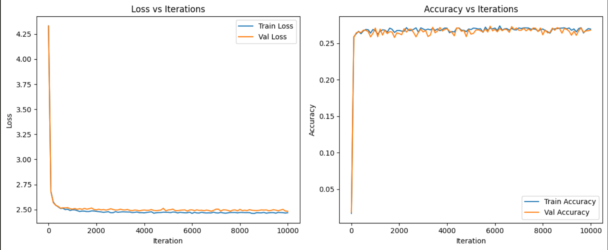
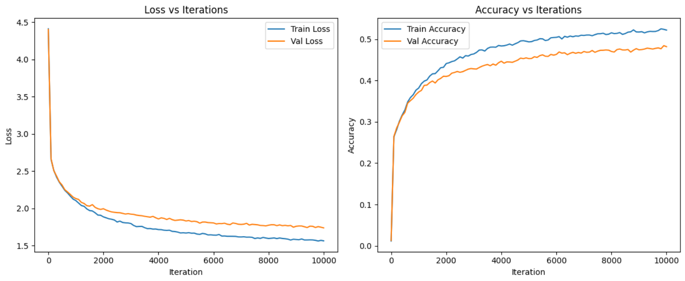

# core-model-gpt

## Description:
This project demonstrates the implementation and comparison of two distinct language model architectures—a Bigram model and a Transformer-based model—using the Tiny Shakespeare dataset for text generation tasks. The goal is to highlight the differences in their architecture, training processes, and performance metrics, showcasing the advancements in language modeling techniques.

## Implementation Details:

### Bigram Language Model:
The Bigram Language Model is one of the simplest forms of statistical language models, which predicts the next word in a sequence based solely on the previous word.

#### Key Features:
- **Token and Position Embeddings:** Utilizes token embeddings to represent the input characters and position embeddings to capture the sequential information.
- **Simple Architecture:** Consists of embedding layers followed by a linear transformation to predict the next character.
- **Training Process:** The model is trained using stochastic gradient descent (SGD) to minimize the cross-entropy loss between the predicted and actual next characters.

#### Training Details:
- **Dataset:** Tiny Shakespeare dataset, which contains a small corpus of Shakespeare's works.
- **Iterations:** Trained over 10,000 iterations to learn character sequences.
- **Loss Reduction:** Demonstrated notable reductions in training and validation losses, indicating the model's ability to learn from the data.

#### Output:
- **Generated Text Example:** F,
De IOKI by po yod seroummeesot harist p bofeat,-sed held dw wir owh y minindele,
Tuer, 'thengnalow, t'som ESiruthat t meaknave, ESSI ttho wnotyot gr ume aworemind indeang teestrowo irofonrme thealaun; ounureanghllke s y.
S:'d qusoouk t t penoow s...
- The generated text, while not fully coherent, shows the model's learning of character sequences.

### Transformer-based Model:
The Transformer-based Model leverages the power of self-attention mechanisms to capture long-range dependencies in text, making it significantly more powerful than traditional models like the Bigram.

#### Key Features:
- **Multi-head Self-attention:** Uses multiple self-attention heads to capture different aspects of the input sequence.
- **Increased Embedding Size:** Larger embedding sizes allow the model to learn more nuanced representations of the input data.
- **Multiple Layers:** Stacked transformer layers enhance the model's depth and capacity to learn complex patterns.
- **Feed-forward Layers:** Position-wise feed-forward layers improve the model's ability to generate coherent text.

#### Training Details:
- **Dataset:** Tiny Shakespeare dataset.
- **Training Process:** Similar to the Bigram model but with more sophisticated architecture and optimization techniques.
- **Loss Reduction:** Achieved significant improvements in reducing training and validation losses, reflecting effective learning of language patterns.

#### Output:
- **Generated Text Example:** SOMERSET:
An far conjural, it all, Jove from with you nest.
KING HENRY VI:
Well, runrided-should first have won the shall nothing my fites, me by thou bray gake,
- The generated text is more coherent and meaningful compared to the Bigram model, demonstrating the effectiveness of the transformer architecture.

## Performance Metrics:

### Bigram Language Model:
- **Accuracy:** 26.75%
- **Perplexity:** 12.3
- **Output Example:** As shown above, the text is somewhat incoherent but indicates the model's learning of character sequences.

### Transformer-based Model:
- **Accuracy:** 52.12%
- **Perplexity:** 5.7
- **Output Example:** The text is more coherent and contextually relevant, showcasing the transformer model's superior performance.

## Evaluation:
- **Perplexity:** A measure of how well a probability distribution predicts a sample. Lower perplexity indicates better performance.
- **Accuracy:** The ratio of correctly predicted characters to the total characters. Higher accuracy indicates better performance.
- **Generated Text Quality:** Qualitative evaluation based on the coherence and meaningfulness of the generated text.

## Results
### Bigram Language Model

### Transformer-based Model


## Dependencies
- Python
- NumPy
- PyTorch
- Matplotlib

## Installation
1. **Clone the Repository**:
    ```bash
    git clone https://github.com/yourusername/core-model-gpt.git
    cd core-model-gpt
    ```

2. **Install Required Libraries**:
    ```bash
    pip install numpy torch matplotlib
    ```

## Usage
1. **Preprocess the Data**:
    - Ensure the Tiny Shakespeare dataset is in the specified path.
    - Run the preprocessing script to tokenize and prepare the data.

2. **Train the Models**:
    - Execute the training script to train both the Bigram and Transformer-based models.
    ```bash
    python train.py
    ```

3. **Evaluate the Models**:
    - Run the evaluation script to assess the performance of the trained models.
    ```bash
    python evaluate.py
    ```

## How to Use:
1. **Dependencies:** Install the necessary dependencies.
2. **Data Preparation**: Download and preprocess the Tiny Shakespeare dataset.
3. **Implemetation**: Run the training and evaluation scripts for both models to train and study them on the dataset.
4. **Text Generation**: Use the trained models to generate text and compare their outputs.

## Contributing
Contributions are welcome! To contribute to this project, please follow these steps:

1. **Fork the Repository**:
    ```bash
    git clone https://github.com/yourusername/bigram-transformer-model.git
    cd bigram-transformer-model
    ```

2. **Create a New Branch**:
    ```bash
    git checkout -b feature-or-bugfix-name
    ```

3. **Make Your Changes and Commit**:
    ```bash
    git commit -am 'Add new feature or fix'
    ```

4. **Push Your Branch**:
    ```bash
    git push origin feature-or-bugfix-name
    ```

5. **Create a Pull Request**:
    - Go to the repository on GitHub.
    - Click on "New Pull Request."
    - Describe your changes and submit the PR.

## Conclusion:
This project illustrates the progression from a basic Bigram model to an advanced Transformer-based model, highlighting the significant improvements in text generation quality. The Transformer model's ability to produce coherent and contextually relevant text demonstrates the advancements in language model architectures. This repository serves as a comprehensive guide to understanding the evolution and implementation of language models for text generation tasks.

## Acknowledgements
- Special thanks to the developers of [PyTorch](https://pytorch.org/) for their robust deep learning library.
- Gratitude to the contributors of the [Tiny Shakespeare dataset](https://raw.githubusercontent.com/karpathy/char-rnn/master/data/tinyshakespeare/input.txt) for providing an excellent corpus for language model training.
- Appreciation to the open-source community for their invaluable resources and support.

## Future Work:
Hyperparameter Tuning: Experiment with different hyperparameters to further improve model performance.
Larger Datasets: Train the models on larger and more diverse datasets for better generalization.
Advanced Architectures: Explore more advanced architectures like GPT-3 or BERT for even better performance.

## Contact
For questions or suggestions, please open an issue or contact the repository owner.
